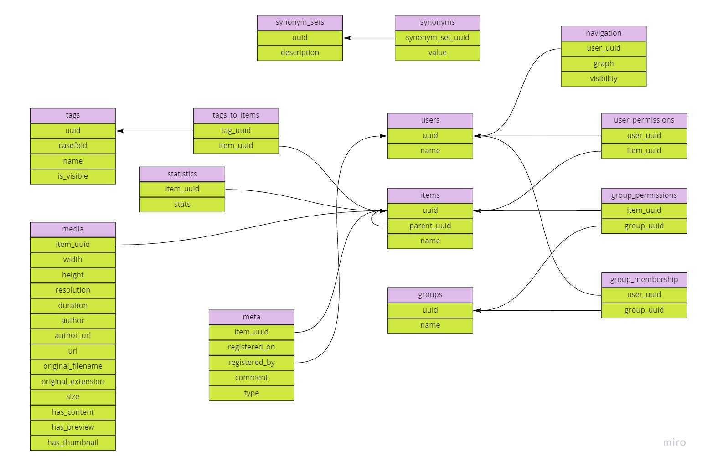

# Соображения о создании Omoide v2.0

Имеющаяся версия продемонстрировала умеренный интерес публики. Здравый смысл
показывает, что я не потяну дальнейшую разработку, если проект будет завязан
только на анимешные картинки. Надо всё-же реализовать изначальную задумку с
пользователями и возможностью загружать в систему личный фотоархив.

## Что плохо в текущей версии

### Путаница с realm/theme/group (иерархия смешана со схемой хранения)

Первые так и не были реализованы, а в остальных постоянно возникает путаница
что куда загружать и что где записывать. Из-за того, что они живут в разных
таблицах БД, приходится иметь отдельные теги для тем и отдельные для записей.

### Система хранения данных смешана с системой поиска

Поисковая машина заточена под плоские структуры данных и не может работать с
деревьями. Из-за этого система хранения деформирована в угоду системе поиска,
что неправильно.

### Нет пользователей

Хочется загрузить в систему и личные фотографии, но при этом не давать публике
к ним доступ. Нужна система пользователей, позволяющая разграничить доступ.

### Технические теги видны пользователю

Чтобы дать ссылку на конкретную группу, приходится давать поисковый запрос с
UUID сущности, при этом сам UUID становится виден пользователю в строке
запроса. Надо сделать так, чтобы можно было формировать эти ссылки без указания
таких подробностей.

### Кривая пагинация

Пагинатор сломан и мне не хватает мозгов его починить. Надо было писать
нормальное решение, а не тяп-ляп и в продакшон.

### Нет всплывающих подсказок

Не особо важная проблема. Но вообще хотелось бы иметь понимание, что за записи
отображаются на экране если навести на них мышкой.

## Что надо сделать

### Сделать одноранговые записи с возможностью формировать из них деревья

Здесь надо явно разделить концепт иерархии данных:

1. Все записи теперь будут равнозначны, будут иметь опционального родителя и
   могут иметь опциональных потомков.
2. Предполагается, что у коллекций (типа книг и альбомов) будет имя, в то время
   как у рядовых записей имени не будет. Так можно будет различать их
   графически.

При поиске будут выводиться все типы записей, как коллекции, так и обычные
страницы.

### Не ограничивать архитектуру возможностями поисковой машины

Сейчас, когда поисковая машина вынесена в отдельный сервис, надо отделить
систему хранения от поиска. С точки зрения иерархии, хотелось бы видеть
деревья, наследование характеристик, тегов и вот это вот всё. Но поисковая
машина заточена под плоские структуры данных и не может работать с деревьями. В
сущности, на этапе сборки индексов, можно обработать все деревья и разложить их
в плоскость.

Пример цепочки записей:

```
Животные 
    └ Млекопитающие 
           └ Кошки
```

Внутри поисковой машины можно условно разложить дерево в нечто подобное:

```json
[
    {
        "uuid": "u1",
        "name": "Животные",
        "tags": [
            "Животные"
        ]
    },
    {
        "uuid": "u2",
        "name": "Млекопитающие",
        "tags": [
            "Животные",
            "Млекопитающие"
        ]
    },
    {
        "uuid": "u3",
        "name": "Кошки",
        "tags": [
            "Животные",
            "Млекопитающие",
            "Кошки"
        ]
    }
]
```

Т.е. по итогу мы имеем плоскую структуру данных с кучей вспомогательных
записей, позволяющих нам искать в ней как в дереве. Есть правда риск, что
количество этих метаданных станет запредельным и система подавится. Чем глубже
будет граф, тем больше записей будет плодиться по мере погружения в него.

На текущем этапе мне кажется, что дело не дойдёт до таких масштабов.

Пользователь будет порождать деревья, расписывающие отношения, а внутри всё это
будет перемалываться в одну простую структуру. Ну что здесь может пойти не так,
правда? :)

Кстати, потенциально такой поход позволит создавать пустые коллекции, которые
просто включают в себя уже собранные в других местах данные. Если начать такое
делать, надо будет следить, чтобы пользователь не сделал циклов в графе.

### Сделать отдельный эндпоинт для просмотра коллекции

Должен действовать аналогично обычному поиску, но не должен выводить саму
коллекцию в результатах. Например, пользователь ищет "кошки". Обычный поиск
выведет ему всё, что имеет такой тег вместе с самой коллекцией "Кошки". Новый
эндпоинт будет просто показывать результат без этой коллекции. Мелочь, но
должно избавить от небходимости ссылаться на конкретный UUID, чтобы показать
кому-то материал. UUID собственно останется, просто будет внутри адресной
строки, а не внутри поискового запроса.

### Добавить пользователей

Чтобы нормально работать с личным фотоархивом и не светить фотками домашнего
кота на весь интернет, надо иметь систему доступа с пользователями. Её
предполагается сделать так же топорно - в конечном итоге получить для каждой
записи перечень пользователей, которые могут её смотреть. Для этого по всей
видимости придётся сделать в индексе ещё один метод, проверяющий права
пользователя на картинку (чтобы nginx снаружи дёргал).

Сама логика раздачи прав просмотра должна быть древовидной. Но при формировании
индексов, её также надо низводить до плоской структуры (и надеяться, что размер
индекса не станет запредельным).

Это предъявляет более строгие требования к индексу и скорости его ответа. Хотя
с другой стороны, индекс у нас неизменяемый, так что можно вероятно несколько
экземпляров иметь.

Подозреваю, что очень быстро надоест руками проставлять что кому видимо. Надо
добавить группы, чтобы такая расстановка прав делалась автоматически. При этом
сами группы будут эфемерными, они не будут никак участвовать в поиске. С их
помощью просто будут формироваться опять же плоские структуры.

### Надеяться, что индекс не бахнет

Реально беспокоит перспектива порождения индекса запредельного размера. Я же по
сути пытаюсь имитировать графовую базу данных на плоской коллекции. Хранить это
в обычной sql базе не хочется т.к. будут нужны рекурсивные вызовы да и скорость
может быть не очень.

Одна надежда - если изолировать индекс в отдельном микросервисе, потом можно
будет его не очень болезненно переделать.

### Схема базы данных

Предполагается что-то подобное:



### Сама база данных

Практика показывает, что первоначальная идея "сделаем всё иммутабельным и будем
генерировать каждый раз заново" мягко говоря не очень быстро работает. Пока
база маленькая, генерировать файл SQLite на каждый чих позволительно. Но когда
этих файлов становятся десятки, начинаются проблемы. В принципе чёрт с ней с
производительностью, я изначально планировал, что время сборки индекса вполне
может быть несколько суток. Но по мере увеличения размеров, уже просто
концептуально это начинает странно смотреться.

Я постепенно прихожу к ситуации, в которой у меня есть два объекта воздействия:
каталог исходных данных и база данных. По сути я должен привести состояние базы
данных к тому виду, который будет соответствовать исходному каталогу. Т.е. от
односторонней истории, когда я только генерирую данные и каждый раз всё
перетираю надо перейти к тому что я вычисляю дельту между двумя состояниями и
воздействую только на неё. По идее, чем больше база, тем важнее становится этот
подход.

Кроме того, изначальная идея "буду при старте указывать из какого файла читать
базу" создаёт просто невероятное количество мороки. Из-за этого подхода мне
пришлось сделать кучу телодвижений в приложении, индексе, наплодить синглтонов
для хранения путей к этой базе. Вместо этого можно было бы признаться себе, что
нормальная база данных доступная по сети в сущности лучше решала бы мои
проблемы.

Только важно иметь две таких базы. Один локальный постгрес, один удалённый.
Синхронизацию между ними делать инструментами репликации или чем то подобным.

Для локального постгреса нужен докер, а я:

1. толком не умею с ним работать (пора бы уже научиться)
2. не могу запустить его на машине пока у меня не активирован windows (пора бы
   решить эту проблему)

Можно было бы тогда запаковать все компоненты в докер-контейнеры и не
заморачиваться пробросом файликов sqlite.
